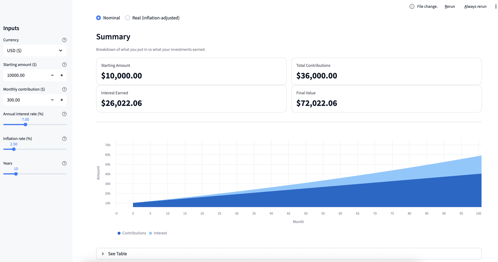

# Wealth Simulator

Interactive wealth growth simulator built with **Python** + **Streamlit**.

Adjust starting amount, monthly contributions, expected annual return, time horizon, inflation, and currency to explore how your wealth could grow over time. Includes **Nominal vs Real (inflation-adjusted)** views and **scenario comparison** presets.

## Features
- Currency selector (display formatting)
- Monthly contributions + compounding simulation
- Nominal vs Real (inflation-adjusted) toggle
- Scenario comparison mode (Conservative / Moderate / Aggressive presets)
- Summary tiles (starting amount, contributions, interest, final value)
- Interactive Altair charts:
  - Single mode: stacked contributions vs. interest
  - Compare mode: multi-line scenario chart + end-of-horizon tiles
- Detailed results table
- **Export results to CSV** (Download button)
- Tested simulation core with `pytest`
- Linting with `ruff`

## Tech Stack
- Python (venv)
- Streamlit (UI)
- Pandas (data)
- Altair (charting)
- Pytest (tests)
- Ruff (lint)

## Getting Started

### 1) Clone
[bash]

git clone <YOUR_REPO_URL>
cd wealth-simulator

### 2) Create virtual environment
python3 -m venv .venv
source .venv/bin/activate
python -m pip install --upgrade pip

### 3) Install dependencies
python -m pip install -e ".[dev]"
Run the App
streamlit run app.py
Run Tests
python -m pytest
Lint
ruff check .
Project Structure
wealth-simulator/
  app.py                      # Streamlit UI
  pyproject.toml              # dependencies + tool config
  src/wealth_simulator/       # simulation package
    __init__.py
    sim.py                    # core simulation logic
  tests/                      # pytest tests
    test_smoke.py
Roadmap

Add compounding frequency toggle (monthly/annual)

Add inflation-adjusted view (real vs nominal)

Add export: download CSV

Add scenarios/presets (Conservative / Moderate / Aggressive)

Resume Bullet Ideas

Built an interactive wealth simulator in Streamlit with parameterized inputs, performance visualization, and results breakdown.

Implemented a reusable simulation engine with monthly compounding and contributions, covered by automated unit tests (pytest).

Established a production-style Python project layout using pyproject.toml, editable installs, and Ruff linting.

## License
MIT
